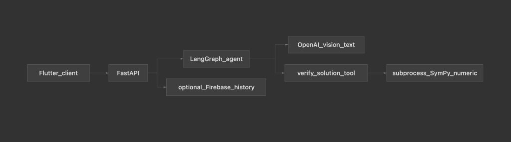

# Demo Guide

##  1: The Hook & The Problem

**Title:** Bridging the Trust Gap in AI Education

### The Problem

Current GenAI homework helpers suffer from **"Hallucination by Confidence."** Students get answers that look right but are mathematically flawed, leading to a breakdown in learning and trust.

### The Vision

A GenAI Tutor that prioritizes **Verifiability** over **Just Answers**.

### The Solution

An intelligent agent that uses symbolic computation to self-correct and provide an **"Honest UI"**—explicitly labeling answers as **Verified** or **Unverified**.

---

##  2: User Value & Market Differentiator

**Title:** Beyond the Chatbot: Engineering for Accuracy

### Primary User

Students needing immediate, step-by-step guidance from photos/text.

### Secondary Users

Parents and Teachers seeking "safe" AI that follows pedagogical standards.

### The Differentiator

- **Not just a prompt:** We use a **tool-augmented agent** architecture.
- **Isolated Verification:** Math isn't left to the LLM's "feeling"; it is sent to a **bounded subprocess** for rigid calculation.
- **Pedagogical Safety:** Lowering the harm of **"Confident Incorrectness."**

---

##  3: System Architecture

**Title:** Modular Architecture for Reliability

### Separation of Concerns

- **Reasoning Layer:** LLM (Vision + Text) handles intent and explanation.
- **Execution Layer:** Isolated SymPy/Python subprocess handles the **ground truth.**

### Agentic Loop

The model proposes a solution → The tool validates the math → The UI reflects the verification status.

### Production Readiness

Focus on **schema-driven JSON** responses and **error-bounded subprocesses** to prevent system crashes during complex queries.

---

##  4: Live Demo Guide (The Value Story)

**Title:** Demo Walkthrough: Trust in Action

### Scenario A: The "Verified" Path

Algebraic problem → LLM solves → SymPy confirms → UI displays a **Green Badge**.

### Scenario B: The "Honest" Path

Conceptual/Non-algebraic problem → System recognizes it cannot "prove" the answer → UI displays **Unverified** (but helpful) steps.

### The "Why"

Transparency is the feature. We teach students to **critique AI**, not just consume it.

---

##  5: Product Roadmap & Evolution

**Title:** Scaling from Prototype to Classroom

### Phase 1: Deepening Coverage

Expand verification to **Calculus, Chemistry, and Physics** via specialized solvers.

### Phase 2: Teacher/School Integration

**"Socratic Mode":** Toggle to hide final answers and only provide hints based on school policy.

### Phase 3: Optimization & Safety

- **Cost:** Edge-OCR to reduce token usage.
- **Safety:** PII scrubbing for student-uploaded images and automated audit logs.

---

##  6: Summary & Vision

**Title:** Engineering Trust into Generative AI

### Core Philosophy

GenAI for UX and reasoning; **Engineering** for boundaries and safety.

### The Goal

A tool that doesn't just give answers, but builds **confidence through verified logic**.

### Open Floor

Architecture deep-dive, Evaluation metrics, or Scaling strategy?
