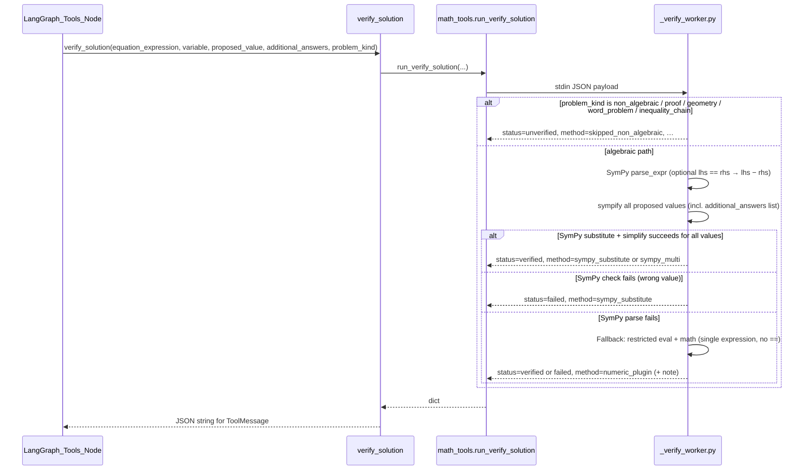

# Math Problem Solver — Sequence Flow

This document describes the sequence from **user submits problem (image and/or text)** to **user gets response**, including the **layered verification** path (SymPy, multi-answer, non-algebraic skip, optional LLM critique).

---

## 1. High-level flow (end-to-end)

```mermaid
sequenceDiagram
  participant User
  participant Frontend
  participant API
  participant LangGraph as LangGraph_Agent
  participant OpenAI
  participant VerifyTool as verify_solution_tool
  participant Worker as _verify_worker_subprocess
  participant Critique as verification_critique_optional
  participant Firebase

  User->>Frontend: Upload image and/or enter problem text
  Frontend->>Frontend: Encode image to base64 (if any)
  Frontend->>API: POST /solve-math-problem (image_base64, problem_text, use_verification, …)
  API->>API: Normalize image to PNG base64; build data URL if image present

  alt use_verification is True
    API->>LangGraph: run_math_agent_langgraph(image_url, problem_text)
    loop Agent loop until last AIMessage has no tool_calls
      LangGraph->>OpenAI: Chat with vision + tools (optional image + text)
      OpenAI-->>LangGraph: AIMessage (content and/or tool_calls)
      alt AIMessage has tool_calls (verify_solution)
        LangGraph->>VerifyTool: verify_solution(equation, variable, value, additional_answers, problem_kind)
        VerifyTool->>Worker: run_verify_solution → subprocess _verify_worker.py (JSON stdin)
        Worker-->>VerifyTool: status, method, message, verified
        VerifyTool-->>LangGraph: ToolMessage JSON
        LangGraph->>LangGraph: Update verification_status, method, message; correction_note if failed
      end
    end
    LangGraph-->>API: solution, steps, answer, verified, correction_note, verification_*
    opt verification_status == unverified and MATH_VERIFICATION_CRITIQUE enabled
      API->>Critique: run_verification_critique (OpenAI JSON: plausible / notes)
      Critique-->>API: verification_critique string or None
    end
  else use_verification is False
    API->>OpenAI: One-shot completion (JSON schema response)
    OpenAI-->>API: solution JSON
    API->>API: Parse steps, answer; verification fields = None
  end

  API->>API: Build MathProblemResponse (confidence from outcome + verification_method)
  opt user_email present and Firebase configured
    API->>Firebase: Save problem_data (verified, verification_status, …)
  end
  API-->>Frontend: MathProblemResponse (solution, steps, answer, confidence, verified, verification_status, verification_method, verification_message, verification_critique, correction_note)
  Frontend->>User: Solution UI: Verified badge if verified; Verification card (method + message) if verified; Review note if critique present when not verified
```

---

## 2. Verification path — LangGraph agent loop (detail)

When `use_verification` is **True**, the API uses a LangGraph agent that can call the `verify_solution` tool. Agent state tracks **`verification_status`**, **`verification_method`**, **`verification_message`**, plus internal **`verified`** / **`correction_note`**.

```mermaid
sequenceDiagram
  participant API as API_Endpoint
  participant Graph as LangGraph_Graph
  participant AgentNode as Agent_Node
  participant LLM as ChatOpenAI
  participant ToolsNode as Tools_Node
  participant MathTools as math_tools.run_verify_solution

  API->>Graph: invoke(initial_state: SystemMessage + HumanMessage with optional image + text)
  Graph->>AgentNode: agent node

  loop Until last message has no tool_calls
    AgentNode->>LLM: invoke(messages) with bind_tools(verify_solution)
    LLM-->>AgentNode: AIMessage (content and/or tool_calls)
    AgentNode-->>Graph: state with new AIMessage appended

    alt AIMessage has tool_calls
      Graph->>ToolsNode: tools node (ToolNode)
      ToolsNode->>MathTools: run_verify_solution(payload)
      MathTools-->>ToolsNode: verified, status, method, message
      ToolsNode->>ToolsNode: ToolMessage(json); merge state from last tool result
      ToolsNode-->>Graph: updated state
      Graph->>AgentNode: agent node again
    else AIMessage has no tool_calls
      Graph->>Graph: END
    end
  end

  Graph-->>API: final_state (messages, verification_status, verification_method, verification_message, …)
  API->>API: Map to API semantics: verified True / False / None from verification_status
  API->>API: Parse final AIMessage JSON → solution, steps, answer
```

**API mapping of `verified` (honest semantics):**

| `verification_status` from last tool | `verified` in HTTP response |
|----------------------------------------|-----------------------------|
| `verified`                             | `true`                      |
| `failed`                               | `false`                     |
| `unverified` or tool never ran         | `null`                      |

---

## 3. verify_solution tool → `_verify_worker.py` (detail)

The tool runs in an **isolated subprocess** (`_verify_worker.py`) with timeout (~8s). No arbitrary code execution in the API process.



**Tool parameters (summary):**

| Parameter | Role |
|-----------|------|
| `equation_expression` | SymPy string: `f(var)=0` or `lhs == rhs`; use `**` for powers, `log(x)` not `math.log(x)`. |
| `variable` | Symbol name, e.g. `x`. |
| `proposed_value` | Primary answer string. |
| `additional_answers` | Extra roots: comma-separated or JSON array string. |
| `problem_kind` | `algebraic_equation`, `multi_answer`, or skip family: `non_algebraic`, `proof`, `geometry`, `word_problem`, `inequality_chain`. |

---

## 4. Optional LLM critique (unverified only)

When **`verification_status == "unverified"`** after the agent run, the solver may call **`run_verification_critique`** if the environment variable **`MATH_VERIFICATION_CRITIQUE`** is set to a truthy value (`1`, `true`, `yes`, `on`). That issues a separate **JSON-object** completion (consistency / plausible / notes). The result is exposed as **`verification_critique`** on the HTTP response.

---

## 5. Response shape back to client

After the flow completes, the API returns a **MathProblemResponse**:

| Field | Description |
|-------|-------------|
| `solution` | Full solution text from the agent/LLM. |
| `steps` | List of solution steps. |
| `answer` | Final answer string. |
| `confidence` | Depends on outcome: higher when `verified` and SymPy-backed; lower when failed or unverified; ~0.85 when verification is off. |
| `processing_time` | Seconds elapsed since request start. |
| `verified` | `true` only if mechanical check passed; `false` if check failed; `null` if verification off or unverified / no check. |
| `verification_status` | `"verified"` \| `"failed"` \| `"unverified"` when `use_verification` is True; else `null`. |
| `verification_method` | e.g. `sympy_substitute`, `sympy_multi`, `numeric_plugin`, `skipped_non_algebraic`, `none`. |
| `verification_message` | Human-readable detail from the worker (or agent-visible tool text). |
| `verification_critique` | Optional second-pass LLM note when unverified + env enabled. |
| `correction_note` | e.g. set when a tool run returned `failed` and the agent was prompted to correct. |

**Flutter client:** when `verified == true`, the UI can show **verification method** and **verification message**; when `verified` is not true and **`verification_critique`** is present, show the **review note** instead (see `SolutionDisplayWidget`).

---

## 6. Related files (backend)

| File | Role |
|------|------|
| `main.py` | FastAPI routes; `POST /solve-math-problem`. |
| `solver.py` | Orchestrates agent vs one-shot path, critique, Firestore persist, response assembly. |
| `math_agent.py` | LangGraph graph, `verify_solution` tool, system prompt, return tuple with verification fields. |
| `math_tools.py` | Spawns `_verify_worker.py` subprocess with JSON payload. |
| `_verify_worker.py` | SymPy + numeric fallback + `problem_kind` skip logic. |
| `math_verification_critique.py` | Optional critique LLM call. |
| `schemas.py` | `MathProblemRequest` / `MathProblemResponse` field definitions. |
