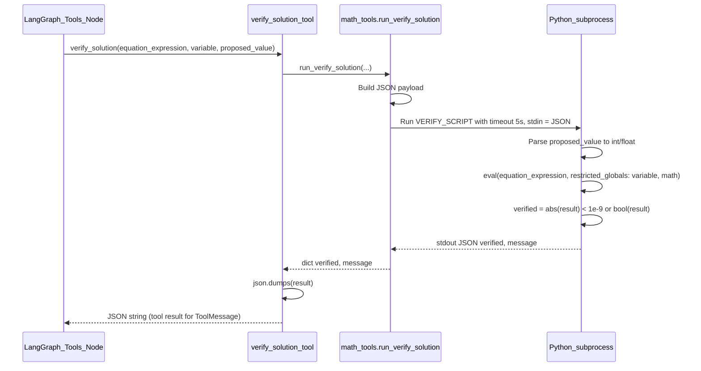

# Math Problem Solver — Sequence Flow

This document describes the sequence from **user uploads image** to **user gets response**.

---

## 1. High-level flow (end-to-end)

```mermaid
sequenceDiagram
  participant User
  participant Frontend
  participant API
  participant LangGraph as LangGraph_Agent
  participant OpenAI
  participant VerifyTool as verify_solution_tool
  participant Firebase

  User->>Frontend: Upload image / capture photo
  Frontend->>Frontend: Encode image to base64
  Frontend->>API: POST /solve-math-problem (image_base64, use_verification)
  API->>API: Decode image, convert to PNG base64 URL

  alt use_verification is True
    API->>LangGraph: run_math_agent_langgraph(image_url)
    loop Agent loop until no tool_calls
      LangGraph->>OpenAI: Chat with vision + tools (image + prompt)
      OpenAI-->>LangGraph: AIMessage (solution text or tool_calls)
      alt AIMessage has tool_calls
        LangGraph->>VerifyTool: verify_solution(equation, variable, value)
        VerifyTool-->>LangGraph: verified true/false, message
        LangGraph->>LangGraph: Append ToolMessage, loop to agent
      end
    end
    LangGraph-->>API: solution_text, steps, answer, verified, correction_note
  else use_verification is False
    API->>OpenAI: One-shot vision completion (image + prompt)
    OpenAI-->>API: solution text
    API->>API: Parse steps, answer; verified = None
  end

  API->>API: Build MathProblemResponse (confidence from verified)
  opt user_email present and Firebase configured
    API->>Firebase: Save problem_data (steps, answer, verified, etc.)
  end
  API-->>Frontend: MathProblemResponse (solution, steps, answer, confidence, verified, correction_note)
  Frontend->>User: Show solution, steps, Verified badge if verified, correction note if any
```

---

## 2. Verification path — LangGraph agent loop (detail)

When `use_verification` is **True**, the API uses a LangGraph agent that can call the `verify_solution` tool. The flow inside the graph:

```mermaid
sequenceDiagram
  participant API as API_Endpoint
  participant Graph as LangGraph_Graph
  participant AgentNode as Agent_Node
  participant LLM as ChatOpenAI
  participant ToolsNode as Tools_Node
  participant MathTools as math_tools_subprocess

  API->>Graph: invoke(initial_state: SystemMessage + HumanMessage with image)
  Graph->>AgentNode: agent node

  loop Until last message has no tool_calls
    AgentNode->>LLM: invoke(messages) with bind_tools(verify_solution)
    LLM-->>AgentNode: AIMessage (content and/or tool_calls)
    AgentNode-->>Graph: state with new AIMessage appended

    alt AIMessage has tool_calls
      Graph->>ToolsNode: tools node (state)
      ToolsNode->>MathTools: run_verify_solution(equation_expression, variable, proposed_value)
      MathTools->>MathTools: Subprocess: eval equation with value, check abs(result) < 1e-9
      MathTools-->>ToolsNode: verified, message
      ToolsNode->>ToolsNode: Build ToolMessage(s), set verified/correction_note in state
      ToolsNode-->>Graph: state with ToolMessages appended
      Graph->>AgentNode: agent node again (with tool results in messages)
    else AIMessage has no tool_calls
      Graph->>Graph: END
    end
  end

  Graph-->>API: final_state (messages, verified, correction_note)
  API->>API: Extract last AIMessage content as solution_text; parse steps, answer
  API-->>API: Return tuple to solve_math_problem handler
```

---

## 3. verify_solution tool execution (detail)

When the agent calls the `verify_solution` tool, the backend runs a safe subprocess:



---

## 4. Response shape back to client

After the flow completes, the API returns a **MathProblemResponse**:

| Field              | Description                                                                 |
|--------------------|-----------------------------------------------------------------------------|
| `solution`         | Full solution text from the agent/LLM.                                     |
| `steps`            | List of solution steps (split by `\n\n`).                                  |
| `answer`           | Final answer (last step or extracted).                                     |
| `confidence`       | 0.98 if `verified` is true, else 0.85 (or 0.85 when verification disabled). |
| `processing_time`  | Seconds elapsed since request start.                                       |
| `verified`         | True if verify_solution returned true; only when use_verification is True.|
| `correction_note`  | Set to "Corrected after verification failed." if a verification failed.   |

The frontend shows the solution, steps, a **Verified** badge when `verified === true`, and the correction note when present.
